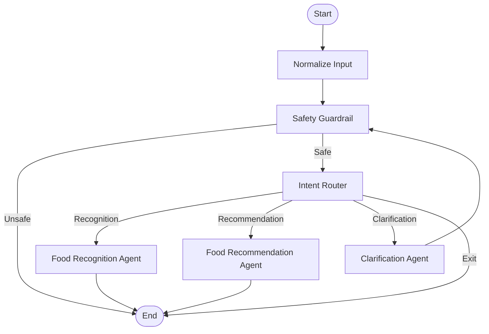

<!-- SUMMARY: Level 1开发文档 | DATE: 2026-03-27 -->
# WABI Agent Backend 开发文档 (Level 1)

## 1. 项目简介

基于 **LangGraph** 和 **Google Gemini** 构建的多模态智能代理编排系统。该系统旨在通过智能路由和编排，处理用户的多模态输入（文本、图像），并提供食物识别、健康推荐、健康推荐科普等服务。

### 核心技术栈
- **LangGraph**: 用于构建有状态的、多角色的代理工作流。
- **Google Gemini (2.5 Flash Exp)**: 提供强大的多模态理解（视觉、文本）和结构化数据生成能力。
- **Pydantic**: 用于数据验证和结构化输出定义。
- **Python 3.10+**: 开发语言。

---

## 2. 系统架构

本系统采用了 **Orchestrator-Workers** 模式，由一个中央编排器（Orchestrator）负责接收输入、执行安全检查、分析意图，并路由到具体的业务代理（Agents）。

### 工作流 (Workflow)



### 核心流程说明
1.  **Normalize**: 标准化用户输入格式。
2.  **Guardrail**: 全局安全护栏，检查输入内容的合规性。
3.  **Router**: 基于 Gemini 的意图识别，决定下一步由哪个 Agent 处理。
    - *Recognition*: 处理带图片的食物识别请求。
    - *Recommendation*: 处理餐厅或饮食推荐请求。
    - *Clarification*: 处理模糊不清的请求，完整后等待用户输入，返回guardrail
4.  **Agents**: 执行具体业务逻辑，生成最终响应。

---

## 3. 目录结构

```text
langgraph_app/
├── agents/                 # 业务代理模块
│   ├── clarification/      # 澄清代理
│   ├── food_recognition/   # 食物识别代理 (Gemini Vision)
│   └── food_recommendation/# 食物推荐代理
├── orchestrator/           # 编排器核心
│   ├── nodes/              # 图节点实现 (Router, Guardrail, Normalization)
│   ├── graph.py            # LangGraph 图定义与编译
│   └── state.py            # 全局状态定义 (GraphState)
├── utils/                  # 工具类
│   └── gemini_client.py    # Gemini API 封装客户端
└── tests/                  # 测试用例
```

---

## 4. 核心模块详解

### 4.1 状态管理 (State Management)
系统使用 `GraphState` (TypedDict) 维护全局上下文，贯穿整个请求生命周期。
- **Input Layer**: `text`, `image_data`, `source`
- **Context Layer**: `session_id`, `user_id`
- **Analysis Layer**: `intent`, `safety_status`
- **Output Layer**: `final_response`,`food_recommendation`,`food_recognition`

### 4.2 路由机制 (Intent Routing)
位于 `langgraph_app/orchestrator/nodes/router.py`。
使用 Gemini 分析用户输入（文本+图像），输出结构化 JSON：
- 意图类型 (`recognition`, `recommendation`, `clarification`, `exit`)
- 置信度 (`confidence`)
- 推理过程 (`reasoning`)

### 4.3 食物识别 (Food Recognition)
位于 `langgraph_app/agents/food_recognition/agent.py`。
- 接收 Base64 编码的图像。
- 调用 Gemini Vision 模型识别食物。
- 返回结构化营养数据（卡路里、蛋白质等）和自然语言评估。

---

## 5. 环境搭建与运行

### 前置要求
- Python 3.10 或更高版本
- Google Gemini API Key

### 安装依赖
```bash
pip install -e .
```

### 配置环境变量
在项目根目录创建 `.env` 文件：
```env
GEMINI_API_KEY=your_gemini_api_key_here
```

### 运行
(此处根据实际入口补充，通常是通过 LangGraph 的运行器或 API 服务启动)
示例代码：
```python
from langgraph_app.orchestrator.graph import graph

# 运行图
result = graph.invoke({
    "input": {
        "text": "这是什么菜？",
        "image_data": "base64_string...",
        "source": "user"
    }
})
print(result["final_response"])
```

---

## 6. 开发指南

### 添加新 Agent
1. 在 `langgraph_app/agents/` 下创建新目录。
2. 实现节点函数 `def my_agent_node(state: GraphState) -> Dict`。
3. 在 `langgraph_app/orchestrator/nodes/router.py` 中更新路由提示词和 `IntentAnalysis` 模型。
4. 在 `langgraph_app/orchestrator/graph.py` 中注册新节点并配置路由规则。

### 修改提示词
所有 Prompt 均定义在各自的节点文件中，修改时请注意保持 JSON 输出格式的指令，以免破坏结构化解析。
