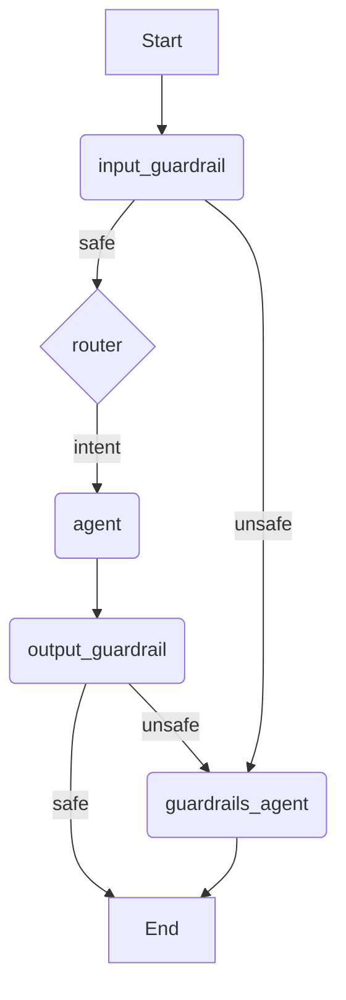

# Refactoring the Guardrails Structure

The goal is to simplify and clarify the guardrails structure by separating input and output checks.

## 1. Refactor the Guardrail Node

We will modify `langgraph_app/orchestrator/nodes/guardrail.py` to create more specific and reusable guardrail nodes.

-   **Create a generic guardrail function**: The existing logic in `global_guardrail_node` will be moved into a generic function that accepts the text to be checked as an argument.
-   **Create `input_guardrail_node`**: This new node will be the entry point of the graph. It will extract the user's latest message from the state and pass it to the generic guardrail function.
-   **Create `output_guardrail_node`**: This new node will be placed after the agent nodes. It will extract the agent's `final_response` from the state and pass it to the generic guardrail function.

## 2. Update the Graph Workflow

We will update `langgraph_app/orchestrator/graph.py` to reflect the new design.

The new workflow will be:

## 3. Implementation Steps

-   [ ] Refactor `langgraph_app/orchestrator/nodes/guardrail.py` to create a generic guardrail function and the new `input_guardrail_node` and `output_guardrail_node`.
-   [ ] Update `langgraph_app/orchestrator/graph.py` to use the new guardrail nodes and implement the new workflow.
-   [ ] Test the changes to ensure the new guardrails structure works as expected.
